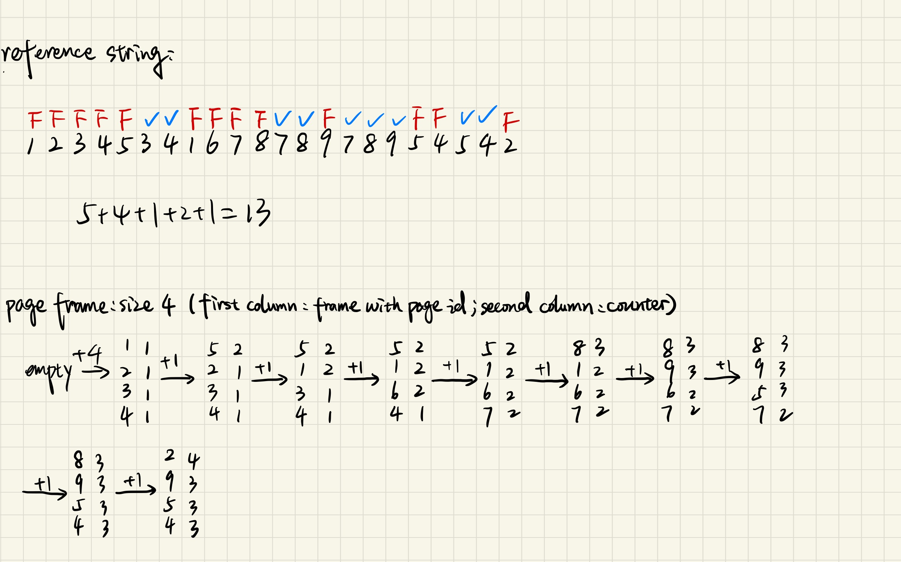

# Question 1

## Part a
i. The initial value of each counter is 0.  
ii. A counter of a frame increases its value by 1 when one page is associated with that frame.  
iii. A counter of a frame decreases its value by 1 when 1 associated page is not required any more.  
iv. Replace the page in the frame which has the smallest value in its counter. When there is a tie, apply the FIFO rule.  

## Part b
13 page faults occur for the algorithm above.

## Part c
The minimum number of page faults is 11.

