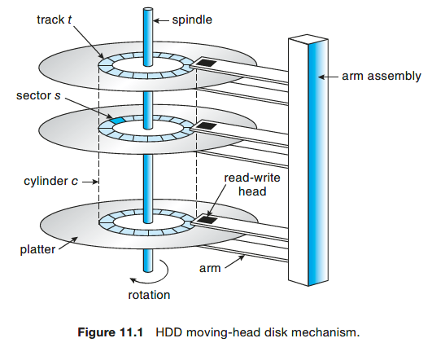
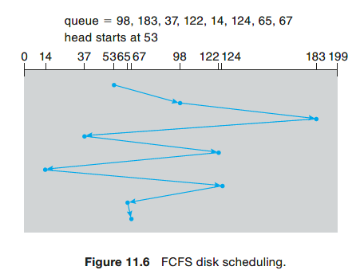
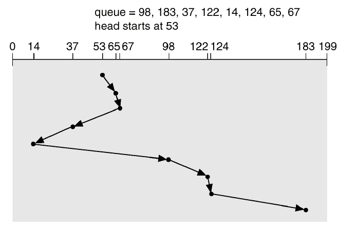
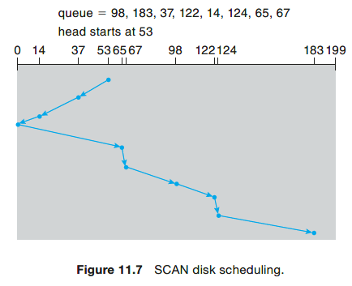
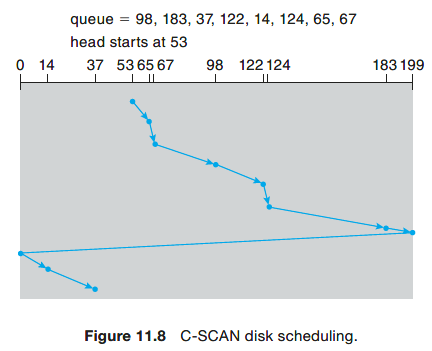
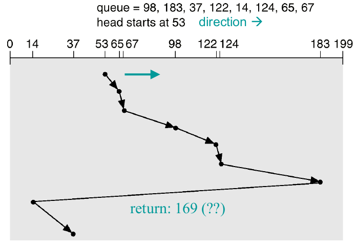
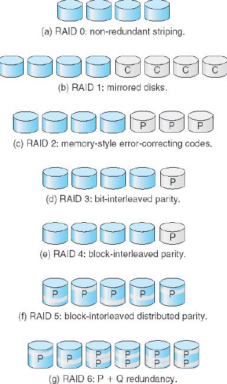
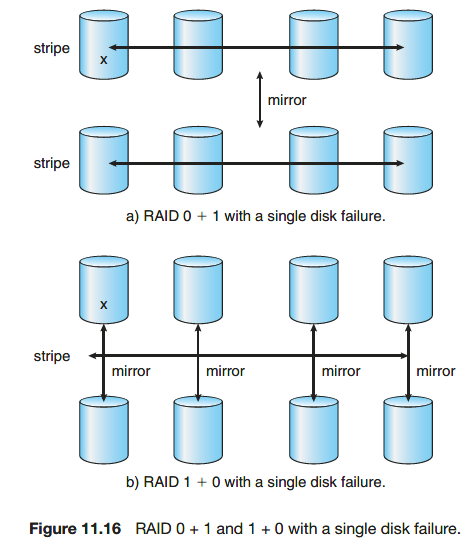

# Module 10 - Mass Storage Structure (Chapter 11)

## Hard Disk Drive (HDD)
* Structure: Each disk **platter** has a flat circular shape. A **read–write head** “flies” just above each surface of every platter. The heads are attached to a **disk arm** that moves all the heads as a unit. The surface of a platter is logically divided into circular **tracks**, which are subdivided into **sectors**. The set of tracks at a given arm position make up a **cylinder**.  
    

## HDD Scheduling
1. Whenever a process needsI/O to or from the drive, it issues a system call to the operating system. The request specifies several pieces of information:
    * Whether this operation is input or output
    * The open file handle indicating the file to operate on
    * What the memory address for the transfer is
    * The amount of data to transfer
2. Parameters to consider:
    * **Seek time (Positioning time)**: the time taken for the disk drive to position itself on the desired cylinder.
    * **Rotation latency time**: the time taken by the read-write head which is on the correct cylinder to position yourself on the desired sector.
    * **Reading time**: time needed to read the track

### FCFS Scheduling
The simplest form of disk scheduling is, of course, the first-come, first-served (FCFS) algorithm (or FIFO).  

* Total movement: 640 = 45 + 85 + 146 + 85 + 108 + 110 + 59 + 2
* Average: 80 = 640 / 8

### SSTF Scheduling
SSTF = Shortest Seek Time First. Selects the request with the minimum seek time from the current head position. Better than FCFS. **Problem**: this algorithm is *not optimal and can cause famine*!  

* Total movement: 236 = 12 + 2 + 30 + 23 + 84 + 24 + 2 + 59
* Average: 29.5 = 236 / 8

### SCAN Scheduling
In the SCAN algorithm (elevator), the disk arm starts at one end of the disk and moves toward the other end, servicing requests as it reaches each cylinder, until it gets to the other end of the disk. At the other end, the direction of head movement is reversed, and servicing continues. The head continuously scans back and forth across the disk. *Avoid famine, while still efficient*! **Problem**: Not much work to do when reversing directions, since requests will have accumulated at the other end of the disk.  

* Total movement: 236 = 53 + 183
* Average: 29.5 = 236 / 8

### C-SCAN Scheduling
The head moves from one end of the disk to the other, servicing requests as it goes. When it reaches the other end, however, it immediately returns to the beginning of the disk, <u> without servicing any requests on the return trip </u>. The return trip is relatively fast, as it does not need to accelerate/decelerate for each request.  

* Total movement: 183 = 146 + 37 (without return) or 382 = 183 + 199 (with return)
* Average: 22.875 (without return) or 47.75(with return); normally the return will be quick so actual cost will be between the two.

### C-LOOK Scheduling
Same idea as C-SCAN, but instead of going back to
the leftmost or rightmost cylinder, going back to the first cylinder
that has a query.  

* Total movement: 153 (without return) or 322 (with return)
* Average: 19.1 (without return) or 40.25 (with return); normally the return will be quick so actual cost will be between the two.

### Comparision
* If the queue often contains very few items, the FCFS algorithm should be preferred (simplicity).
* Otherwise, we should consider:
    * Actual travel time and time to go back to start
    * File and directory organization
    * The average length of the queue
    * The incoming flow of requests

## Disk Management
1. Low-level formatting, or physical formatting (from factory)
    * divide the disk into sectors the controller can read
    * initialize each sector (header, trailer)
2. Partitioning
    * logically partition the disk into one or more groups of cylinders, each of them having its own FS.
    * set the boot partition
3. Logical formatting or “making a file system”
    * write the FS data on disc i.e. write FAT, the root directory, inodes, …

## Bad Block Management
* Have some spare blocks and when you detect a bad block, use the spare block instead.
    * Example: the HD has nominally 100 blocks, but was fabricated with 110, 0..99 are used, 100-109 are spare. If block 50 fails, the HD controller (after being told by the OS) will use block 100 to store the logical block 50.

## Swap-Space Management
1. Where is the swap space on the disk?
    * As a part of the normal file system
        * Pros: simple, flexible
        * Cons: slow
    * In a separate disk partition, using its own, optimized algorithms and structures
        * Pros: fast
        * Cons: might waste space
2. When to allocate space in swap space?
    * When the process starts
    * When the virtual page is created
    * When the page is replaced
3. Kernel uses **swap maps** to track swap- space use.

## RAID
RAID = Redundant Array of Independent Disks  

* **RAID 0** (dangerous): drive arrays with striping at the level of blocks but without any redundancy.
* **RAID 1**: drive mirroring.
* **RAID 4**: also known as memory-style error-correcting code (ECC) organization. ECC is also used in RAID 5 and 6.
    * For example, the first data block of a sequence of writes can be stored in drive 1, the second block in drive 2, and so on until the N-th block is stored in drive N; the error-correction calculation result of those blocks is stored on drive N + 1.
* **RAID 6**: also called the P + Q redundancy scheme. As well as parity bit P, some error-correcting code like Galois field math are used to calculate the bit Q.

* **RAID 0+1**: InRAID 0 + 1, a set of drives are striped, and then the stripe is mirrored to another, equivalent stripe. 
    * RAID 0 provides the performance, whileRAID 1 provides the reliability. Generally, this level provides better performance than RAID 5. It is common in environments where both performance and reliability are important.
* **RAID 1+0**: drives are mirrored in pairs and then the resulting mirrored pairs are striped.
    * This scheme has some theoretical advantages over RAID 0 + 1. For example, if a single drive fails in RAID 0 + 1, an entire stripe is inaccessible, leaving only the other stripe. With a failure inRAID 1 + 0, a single drive is unavailable, but the drive that mirrors it is still available, as are all the rest of the drives.
