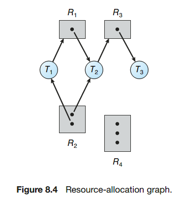
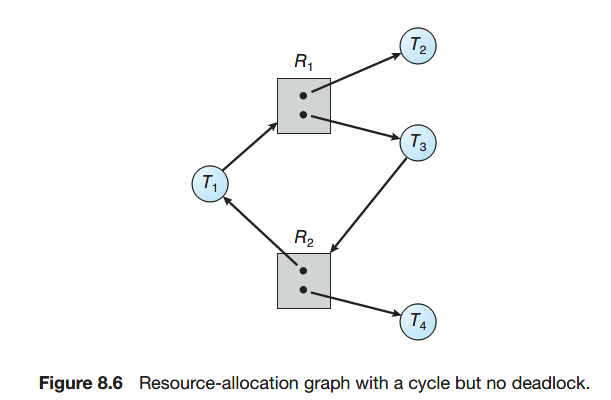

# Module 6 - Deadlock (Chapter 8)

## Deadlock Conditions
1. **Mutual exclusion**: the system has non-shareable resources (only 1 proc at a time can use it)
2. **Hold and wait**: a process holding a non-shareable resource and is waiting to acquire additional resources held by other processes.
3. **No preemption**: a resource can be released only voluntarily by the process holding it, after that process has completed its task.
4. **Circular wait**: there is a process cycle such that each process to complete must use an unshareable resource which is used by the next, and which the next will keep until terminated

## Resource-Allocation Graph

* A set of vertices V and a set of edges E.
* V is partitioned into:
    * P = {P1, P2, … , Pn}, the set which consists of all the procs in the system
    * R = {R1, R2, … , Rm}, the set which consists of all types of resources in the system
* Request edge: directed edge Pi → Rk  
    Assignment edge - directed edge Ri → Pk
* if a resource-allocation graph does not have a cycle, then the system is not in a deadlocked state. If there is a cycle, then the system may or may not be in a deadlocked state.  
    

## Method for Handling Deadlocks
* **Prevent**: design the system in such a way that deadlock is not possible; difficult, very restrictive, suitable for critical systems.
    * *Mutual exclusion*: reduce as much as possible the use of shared resources and critical sections (almost impossible).
    * *Hold and wait*: a process that requests new resources cannot hold up other processes (ask for all resources at once).
    * *No pre-emption*: If a process asks for resources and cannot obtain them, it is suspended and its resources already held are released.
    * *Circular wait*: define an request ordering for resources, a process must ask for resources in this order 

* **Avoid**: deadlocks are possible, but are avoided (avoidance)
    * **Safe state**: System is in safe state if there exists a safe sequence of all processes.
        * When a process requests an available resource, the system must decide if immediate allocation leaves the system in a safe state.
    * Resource-Allocation Graph Algorithm
        * **Claim edge**: Pi → Rj indicates that process Pj *may* request resource Rj; represented by a dashed line.
            * Claim edge is converted to request edge when a process requests a resource.
            * When a resource is released by a process, assignment edge reconverts to a claim edge.
        * The algorithm: if satisfying request creates a cycle in the modified R-A graph (including claim edges), reject the request
    * Banker's algorithm
        * R[i]: Total number of resource i.
        * *Max*. An n × m matrix defines the <u> maximum demand </u> of each thread. If Max[i][j] equals k, then thread Ti may request at most k instances of resource type Rj.
        * *Allocation*. An n × m matrix defines the number of resources of each type currently <u> allocated </u> to each thread. If Allocation[i][j] equals k, then thread Ti is currently allocated k instances of resource type Rj.
        * *Available*. A vector of length m indicates the number of available resources of each type. If Available[j] equals k, then k instances of resource type Rj are available. Note that `Available[j] = R[j] - sum_i(Allocation[i][j])`
        * *Need*. An n × m matrix indicates the remaining resource need of each thread. If Need[i][j] equals k, then thread Ti may need k more instances of resource type Rj to complete its task. Note that `Need[i][j] = Max[i][j] - Allocation[i][j]`.
        * Q[i][j] is the amount of resource j requested by the process i.
            * If Q[i][j] <= Need[i][j] for all i, then continue. Otherwise, report the error (requested amount exceeds the need).
            * If Q[i][j] <= Available[j] for all i, then continue. Otherwise, wait (resource not available yet).
    * Safety algorithm (based on banker's algorithm)
        1. Let Work and Finish be vectors of length m and n, respectively. Initialize Work = Available and Finish[i] = false for i = 0, 1, ..., n - 1.
        2. Find a process i such that both
            * Finish[i] == false
            * Need[i][j] < Work[j] for j = 0, 1, ..., m - 1
            
          If no such i exists, go to step 4.
        3. Work[j] = Work[j] + Allocation[i][j]  
            Finish[i] = true  
            Go to step 2
        4. If Finish[i] == true for all i, then the system is in a safe state.

* **Detect and recover**: Allow deadlocks, recover after
    * Detect
        * Single Instance of Each Resource Type: resource allocation graph  and waiting for graph.  
            
        * Several Instances of Each Resource Type: just use safety  algorithm above. If for some i Finish[i] == false, then the system   is in a deadlock state.
    * Recover
        * Terminate all processes in deadlock
        * Terminate one process at a time, hoping to eliminate the deadlock cycle
* **Ignore**: ignore the problem and pretend that deadlocks never occur in the system. (Most used)
