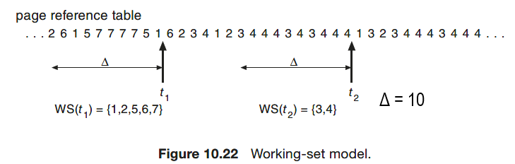
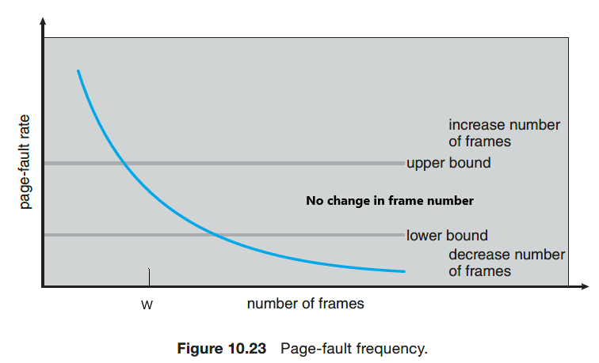

# Module 8 - Virtual Memory (Chapter 10)

## Introduction
* In order for a program to be executed, it does not have to be all in main memory. Only the parts that are in execution need to be in main memory. The other parts can be on secondary memory, ready to be brought into main memory on request. This makes it possible to run programs much larger than physical memory.
* **Principle of locality of references**: references to memory by a process tends to be grouped.
* New page table format
    |Address of the page|Bit present
    |---|---
    |If the page is in main memory, this is an address of the main memory. </br> Otherwise, this is an address of the secondary memory.|1 if in main memory; </br> 0 if in secondary memory.

## Demand Paging
* Definition: bring a page to main memory only when it is needed.
* Page fault may occur during the demand paging.

## Page Fault
* Definition: page fault is an interruption when the logical address refers to a part which is not in the main memory.
* What to do when there is a page fault?
    1. Find it on the secondary memory
    2. Find a free frame
        * If there is a free frame, use it.
        * If there is no free frame, use a page-replacement algorithm to select a **victim frame**.
        * Write the victim frame to secondary storage (if necessary); change the page and frame tables accordingly.
    3. Load the page to the frame
    4. Set the valid bit to 1
    5. Restart the instruction that caused the page fault
* **Average memory access time**
    ```bash
    # p: probability of page faults
    # m: normal memory access time
    # f: page fault processing time
    t = (1 - p) * m + p * f
    ```

## Page Replacement
* **Dirty bit**: set to 1 if the page is modified in the main memory; 0 otherwise. </br>
    If the dirty bit is 0, no need to write the current page back in to the secondary memory since it is not changed.
### Page Replacement Algorithm
1. **OPT algorithm**: select the page for which the time to the next reference is the longest.
    * Pros: least page faults; most efficient
    * Cons: impossible to implement since it is impossible to know the future
    * Still useful since it can serve as a standard to compare with the other algorithms.
2. **LRU algorithm**: replace the page that has not been referenced for the longest time
    * Cons: too costly, require expensive hardware and a great deal of overhead
3. **FIFO algorithm**: treat page frames allocated to a process as a *circular buffer*. When the buffer is full, the oldest page is replaced.
    * Pros: simple to implement
    * Cons: a frequently used page is often the oldest, so it will be repeatedly paged out by FIFO
    * **Belady's anomaly**: in some cases it could have more faults with more memory! FIFO algorithm is an example.
4. **Clock algorithm (second chance)**
    * A circular buffer same as FIFO algorithm
    * A use bit for each frame is set to 1 whenever
        * a page is first loaded into the frame
        * the corresponding page in the main memory is referenced
    * When it is time to replace a page, <u> the first frame encountered with the use bit set to 0 is replaced </u>. During the search for replacement, each use bit set to 1 is changed to 0.
5. Counting algorithms
    * **LFU Algorithm**: replaces page with smallest count
    * **MFU Algorithm**: based on the argument that the page with the smallest count was probably just brought in and has yet to be used
    * Implementation of these algorithms are expensive and rarely used.

## Page Buffering
Pages to be replaced are kept in main memory for a while to guard against poorly performing replacement algorithms such as FIFO.

* Two lists of pointers are maintained: each entry points to a frame selected for replacement.
    * a **free page list** for frames that have not been modified since brought in (no need to swap out)
    * a **modified page list** for frames that have been modified (need to write them out). A frame to be replaced has a pointer added to the tail of one of the lists and the present bit is cleared in corresponding page table entry, <u> but the page remains in the same memory frame </u>. The modified list also serves to write out modified pages in batch (rather than individually).
* At each page fault, the two lists are first examined to see if the needed page is still in main memory.
    * If it is, we just need to set the present bit in the corresponding page table entry and remove the matching entry in the relevant page list.
    * If it is not, then the needed page is brought in, it is placed in the frame pointed by the head of the free frame list (overwriting the page that was there). The head of the free frame list is moved to the next next entry.

## Frame Allocation
When the process receives fewer frames than its minimum, it will generate an excessive number of page faults and be slowed considerably. Hence, it is important to allocate enough frames to each process to achieve its minimum.
* **Equal allocation**: each process has an equal portion of physical memory. </br>
    **Proportional allocation**: each process is allocated according to its size.
* **Global allocation**: the `victim` is taken from any process. </br>
    **Local allocation**: the `victim` is taken from the process that needs the page.

## Thrashing
* Definition: A process is thrashing if it is spending more time paging than executing. This will cause performance issue.
* When OS has a high degree of multiprogramming, a thrashing will happend and CPU usage drops sharply.
* How to avoid thrashing
    * By managing the resident set sizes of processes. The OS must decide how many page frames to allocate to a process, not too few or too many.
    * By controlling the degree of multiprogramming (Load control).

### Working Set
* Definition: The working set of a process at a point in execution consists of the set of pages the process requires for execution without too many page faults.
* Working set is a variable-allocation method with local scope based on the assumption of locality of references. Working set is an approximation of the program’s locality. Δ is the window size.
    
* The working set of a process first grows when it starts executing, and then decreases and stabilizes by the principle of locality. It grows again when the process enters a new locality (transition period), then decreases after a sufficient long time spent in the new locality.
* The following approaches are suggested by working set strategy:
    * Monitor the working set for each process
    * Periodically remove those pages that are not in the working set from the resident set of a process (apply LRU).
    * When the resident set of a process is smaller than its working set, allocate more frames to it. If not enough free frames are available, suspend the process (until more frames are available); i.e., a process may execute only if its working set can be loaded in main memory.
* Problems with working set:
    * measurement of the working set for each process is impractical
    * the optimal value for Δ is unknown and time varying

### Page-Fault Frequency

* Define an upper bound U and lower bound L for page fault rates.
* Allocate more frames to a process if fault rate > than U. </br>
    Allocate less frames if fault rate is < L.
* The resident set size should be close to the working set size W.
* We suspend the process if fault rate > U and no more free frames are available.

### Load Control
* Definition: Determines the number of processes that will be resident in main memory (i.e., the multiprogramming level).
* A working set or page fault frequency algorithm implicitly incorporates load control. Only those processes whose resident set is sufficiently large are allowed to execute.
* Adjust explicitly the multiprogramming level so that the *mean time* between page faults equals the time to process a page fault. Explicit load control requires that we sometimes swap out (suspend) processes.
    * Possible victim selectino criteria: faulting process, last activated process, process with smallest/largest resident set.
    * Locked pages in memory: some pages must be locked in memory (e.g., OS kernel pages). It is also essential to lock in memory pages on which there is execution of I/O. This can be achieved with a **lock bit** on the memory frame.
